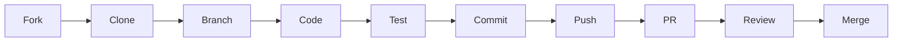

# 🤝 Guía de Contribución - Ready4Hire

¡Gracias por tu interés en contribuir a Ready4Hire! Esta guía te ayudará a empezar.

## Tabla de Contenidos

1. [Código de Conducta](#código-de-conducta)
2. [Cómo Contribuir](#cómo-contribuir)
3. [Configuración del Entorno](#configuración-del-entorno)
4. [Estándares de Código](#estándares-de-código)
5. [Testing](#testing)
6. [Proceso de Pull Request](#proceso-de-pull-request)
7. [Reporte de Bugs](#reporte-de-bugs)
8. [Sugerencias de Features](#sugerencias-de-features)

---

## Código de Conducta

### Nuestro Compromiso

Nos comprometemos a mantener un ambiente respetuoso, inclusivo y profesional para todos los contribuyentes.

### Comportamientos Esperados

✅ **SÍ hacer**:
- Usar lenguaje acogedor e inclusivo
- Respetar puntos de vista y experiencias diferentes
- Aceptar críticas constructivas con gracia
- Enfocarse en lo mejor para la comunidad
- Mostrar empatía hacia otros miembros

❌ **NO hacer**:
- Usar lenguaje o imágenes sexualizadas
- Trolling, comentarios insultantes o ataques personales
- Acoso público o privado
- Publicar información privada sin permiso
- Conducta no profesional

---

## Cómo Contribuir

### Tipos de Contribuciones

Aceptamos varios tipos de contribuciones:

- 🐛 **Bug Fixes**: Corrección de errores
- ✨ **Features**: Nuevas funcionalidades
- 📝 **Documentación**: Mejoras en docs
- 🧪 **Tests**: Agregar o mejorar tests
- 🎨 **UI/UX**: Mejoras de interfaz
- ⚡ **Performance**: Optimizaciones
- 🌐 **i18n**: Traducciones

### Proceso General



1. **Fork** el repositorio
2. **Clone** tu fork localmente
3. **Crea** una nueva branch
4. **Implementa** tus cambios
5. **Ejecuta** tests
6. **Commit** con mensajes descriptivos
7. **Push** a tu fork
8. **Abre** un Pull Request

---

## Configuración del Entorno

### 1. Fork y Clone

```bash
# Fork en GitHub UI, luego:
git clone https://github.com/TU_USUARIO/Ready4Hire.git
cd Ready4Hire

# Agregar upstream
git remote add upstream https://github.com/REPO_ORIGINAL/Ready4Hire.git
```

### 2. Crear Virtual Environment

```bash
# Crear venv
python -m venv venv

# Activar
source venv/bin/activate  # Linux/macOS
# venv\Scripts\activate  # Windows

# Instalar dependencias
pip install -r requirements.txt
pip install -r requirements-dev.txt  # Dev dependencies
```

### 3. Configurar Pre-commit Hooks

```bash
# Instalar pre-commit
pip install pre-commit

# Instalar hooks
pre-commit install

# Ejecutar manualmente
pre-commit run --all-files
```

**Archivo**: `.pre-commit-config.yaml`

```yaml
repos:
  - repo: https://github.com/pre-commit/pre-commit-hooks
    rev: v4.5.0
    hooks:
      - id: trailing-whitespace
      - id: end-of-file-fixer
      - id: check-yaml
      - id: check-added-large-files

  - repo: https://github.com/psf/black
    rev: 23.12.0
    hooks:
      - id: black

  - repo: https://github.com/PyCQA/flake8
    rev: 6.1.0
    hooks:
      - id: flake8

  - repo: https://github.com/PyCQA/isort
    rev: 5.13.2
    hooks:
      - id: isort
```

### 4. Configurar Ollama

```bash
# Instalar Ollama
curl -fsSL https://ollama.com/install.sh | sh

# Descargar modelo
ollama pull llama3.2:3b

# Iniciar servidor
ollama serve > /tmp/ollama.log 2>&1 &
```

### 5. Verificar Instalación

```bash
# Ejecutar tests
pytest tests/ -v

# Verificar migración DDD
python scripts/verify_migration.py

# Iniciar API
python -m uvicorn app.main_v2:app --reload

# Health check
curl http://localhost:8000/api/v2/health
```

---

## Estándares de Código

### Python Style Guide

Seguimos **PEP 8** con algunas excepciones:

- **Línea máxima**: 100 caracteres (no 79)
- **Quotes**: Double quotes `"` preferidas
- **Imports**: Agrupados y ordenados con `isort`

### Estructura de Imports

```python
# 1. Standard library
import json
import logging
from datetime import datetime
from typing import List, Optional

# 2. Third-party
from fastapi import FastAPI, HTTPException
from pydantic import BaseModel
import httpx

# 3. Local imports
from app.domain.entities import Interview
from app.application.services import EvaluationService
from app.infrastructure.llm import OllamaClient
```

### Naming Conventions

| Tipo | Convención | Ejemplo |
|------|------------|---------|
| Variables | `snake_case` | `user_answer` |
| Funciones | `snake_case` | `evaluate_answer()` |
| Clases | `PascalCase` | `InterviewService` |
| Constantes | `UPPER_SNAKE_CASE` | `MAX_INPUT_LENGTH` |
| Privadas | `_leading_underscore` | `_internal_method()` |
| Módulos | `snake_case` | `evaluation_service.py` |

### Docstrings

Usamos **Google Style**:

```python
def evaluate_answer(
    question: str,
    answer: str,
    expected_concepts: list[str]
) -> dict:
    """
    Evalúa la respuesta del candidato usando LLM.

    Args:
        question: Pregunta realizada al candidato.
        answer: Respuesta proporcionada por el candidato.
        expected_concepts: Lista de conceptos que se esperan en la respuesta.

    Returns:
        Diccionario con:
            - score (int): Puntuación de 1-10
            - feedback (str): Retroalimentación detallada
            - concepts_found (list): Conceptos identificados

    Raises:
        ValueError: Si answer está vacío.
        HTTPException: Si Ollama no responde.

    Examples:
        >>> result = evaluate_answer(
        ...     "¿Qué es Docker?",
        ...     "Docker es una plataforma de contenedores",
        ...     ["contenedores", "virtualización"]
        ... )
        >>> result['score']
        8
    """
    if not answer:
        raise ValueError("Answer cannot be empty")

    # Implementation...
```

### Type Hints

Usar type hints en todas las funciones:

```python
from typing import List, Dict, Optional, Union

# ✅ Bueno
def get_questions(
    difficulty: str,
    limit: int = 10
) -> List[Dict[str, str]]:
    pass

# ❌ Malo
def get_questions(difficulty, limit=10):
    pass
```

### Error Handling

```python
import logging

logger = logging.getLogger(__name__)

def risky_operation():
    """Ejemplo de manejo de errores"""
    try:
        result = external_api_call()
        return result
    except httpx.TimeoutException as e:
        logger.error(f"Timeout en API externa: {e}")
        raise HTTPException(status_code=504, detail="External API timeout")
    except httpx.HTTPError as e:
        logger.error(f"Error HTTP: {e}")
        raise HTTPException(status_code=500, detail="External API error")
    except Exception as e:
        logger.critical(f"Error inesperado: {e}", exc_info=True)
        raise
```

---

## Testing

### Estructura de Tests

```
tests/
├── conftest.py              # Fixtures compartidas
├── mocks.py                 # Mocks reutilizables
├── test_integration.py      # Tests de integración
├── test_interview.py        # Tests de entrevistas
└── unit/
    ├── test_evaluation.py   # Tests unitarios
    ├── test_questions.py
    └── test_security.py
```

### Escribir Tests

```python
import pytest
from app.application.services import EvaluationService

class TestEvaluationService:
    """Tests para EvaluationService"""

    @pytest.fixture
    def service(self):
        """Fixture que proporciona servicio"""
        return EvaluationService(llm_service=MockLLMService())

    def test_evaluate_answer_valid_input(self, service):
        """Debe evaluar respuesta válida correctamente"""
        # Arrange
        question = "¿Qué es Docker?"
        answer = "Docker es una plataforma de contenedores"

        # Act
        result = service.evaluate_answer(question, answer)

        # Assert
        assert result['score'] >= 1
        assert result['score'] <= 10
        assert 'feedback' in result
        assert len(result['feedback']) > 0

    def test_evaluate_answer_empty_answer(self, service):
        """Debe lanzar ValueError con respuesta vacía"""
        with pytest.raises(ValueError, match="Answer cannot be empty"):
            service.evaluate_answer("Question?", "")

    @pytest.mark.parametrize("answer,expected_min_score", [
        ("Docker es contenedores", 6),
        ("Contenedores y virtualización ligera", 7),
        ("No sé", 1),
    ])
    def test_evaluate_answer_variations(
        self, service, answer, expected_min_score
    ):
        """Debe evaluar diferentes respuestas apropiadamente"""
        result = service.evaluate_answer("¿Qué es Docker?", answer)
        assert result['score'] >= expected_min_score
```

### Ejecutar Tests

```bash
# Todos los tests
pytest

# Con verbosidad
pytest -v

# Tests específicos
pytest tests/test_interview.py

# Con coverage
pytest --cov=app --cov-report=html

# Solo tests marcados
pytest -m integration

# Parallelize
pytest -n auto
```

### Coverage Mínimo

Mantenemos **>80% coverage**:

```bash
pytest --cov=app --cov-report=term-missing --cov-fail-under=80
```

---

## Proceso de Pull Request

### 1. Crear Branch

```bash
# Actualizar main
git checkout main
git pull upstream main

# Crear branch descriptiva
git checkout -b feature/add-emotion-detection
git checkout -b fix/ollama-timeout
git checkout -b docs/improve-readme
```

**Naming Convention**:
- `feature/` - Nueva funcionalidad
- `fix/` - Bug fix
- `docs/` - Documentación
- `refactor/` - Refactorización
- `test/` - Tests

### 2. Implementar Cambios

```bash
# Hacer cambios
vim app/services/emotion_analyzer.py

# Ejecutar tests
pytest tests/ -v

# Ejecutar linters
black app/
flake8 app/
isort app/
```

### 3. Commit

Seguir **Conventional Commits**:

```bash
git add .
git commit -m "feat: add emotion detection to interview feedback

- Implement MultilingualEmotionDetector
- Add support for Spanish and English
- Include emotion in feedback response
- Add tests for emotion detection

Closes #42"
```

**Tipos de commit**:
- `feat`: Nueva feature
- `fix`: Bug fix
- `docs`: Documentación
- `style`: Formateo (no afecta código)
- `refactor`: Refactorización
- `test`: Agregar tests
- `chore`: Tareas de mantenimiento

### 4. Push y PR

```bash
# Push
git push origin feature/add-emotion-detection

# Ir a GitHub y crear PR
```

### 5. Template de PR

```markdown
## Descripción

Breve descripción de los cambios realizados.

## Tipo de Cambio

- [ ] Bug fix (non-breaking change)
- [ ] Nueva feature (non-breaking change)
- [ ] Breaking change
- [ ] Documentación

## ¿Cómo se ha probado?

- [ ] Tests unitarios
- [ ] Tests de integración
- [ ] Manual testing

## Checklist

- [ ] Mi código sigue el style guide del proyecto
- [ ] He realizado self-review de mi código
- [ ] He comentado áreas complejas
- [ ] He actualizado la documentación
- [ ] Mis cambios no generan nuevos warnings
- [ ] He agregado tests que prueban mi fix/feature
- [ ] Tests nuevos y existentes pasan localmente
- [ ] Cambios dependientes han sido mergeados

## Screenshots (si aplica)

[Agregar screenshots]

## Issues Relacionados

Closes #42
Related to #38
```

### 6. Review Process

1. **Automated Checks**: CI ejecuta tests y linters
2. **Code Review**: Mantainers revisan código
3. **Request Changes**: Si es necesario
4. **Approval**: Cuando todo está OK
5. **Merge**: Squash and merge

---

## Reporte de Bugs

### Template de Issue

```markdown
**Describe the bug**
Descripción clara y concisa del bug.

**To Reproduce**
Pasos para reproducir:
1. Go to '...'
2. Click on '....'
3. Scroll down to '....'
4. See error

**Expected behavior**
Qué esperabas que pasara.

**Actual behavior**
Qué pasó realmente.

**Screenshots**
Si aplica, agregar screenshots.

**Environment:**
 - OS: [e.g. Ubuntu 22.04]
 - Python: [e.g. 3.11.5]
 - Ollama: [e.g. 0.1.17]
 - Ready4Hire: [e.g. 2.0.0]

**Logs**
```
Pegar logs relevantes
```

**Additional context**
Cualquier información adicional.
```

---

## Sugerencias de Features

### Template de Feature Request

```markdown
**Is your feature request related to a problem?**
Descripción clara del problema. Ej: "Me frustra cuando..."

**Describe the solution you'd like**
Descripción clara de lo que quieres que pase.

**Describe alternatives you've considered**
Alternativas que consideraste.

**Additional context**
Screenshots, mockups, ejemplos de otros sistemas, etc.

**Would you like to implement this feature?**
- [ ] Yes, I can implement this
- [ ] I need help implementing this
- [ ] I'd like someone else to implement this
```

---

## Áreas para Contribuir

### 🟢 Buenas Primeras Issues

Busca issues con label `good first issue`:

- Agregar tests faltantes
- Mejorar documentación
- Corregir typos
- Agregar más preguntas a datasets
- Mejorar mensajes de error

### 🟡 Features Pendientes (Roadmap)

**v2.1**:
- [ ] Exportar entrevistas a PDF
- [ ] Dashboard con métricas
- [ ] Integración con calendario

**v2.2**:
- [ ] Análisis de audio en tiempo real
- [ ] Recomendaciones con ML
- [ ] Multi-tenant

### 🔴 Help Wanted

Issues complejos que necesitan experiencia:

- Optimización de modelos ML
- Implementación de Redis cache
- Migración a PostgreSQL
- CI/CD pipeline

---

## Recursos

### Documentación
- [README.md](../README.md)
- [ARCHITECTURE.md](ARCHITECTURE.md)
- [API_DOCUMENTATION.md](API_DOCUMENTATION.md)
- [CONFIGURATION.md](CONFIGURATION.md)
- [TROUBLESHOOTING.md](TROUBLESHOOTING.md)

### Herramientas
- [Black](https://black.readthedocs.io/) - Code formatter
- [Flake8](https://flake8.pycqa.org/) - Linter
- [isort](https://pycqa.github.io/isort/) - Import sorter
- [pytest](https://docs.pytest.org/) - Testing framework

### Comunidad
- **GitHub Discussions**: Preguntas y discusiones
- **Discord**: Chat en tiempo real
- **Email**: dev@ready4hire.example.com

---

## Reconocimientos

Los contributors aparecen en:
- README.md - Contributors section
- CHANGELOG.md - Por cada release
- GitHub Contributors page

¡Gracias por contribuir a Ready4Hire! 🚀
